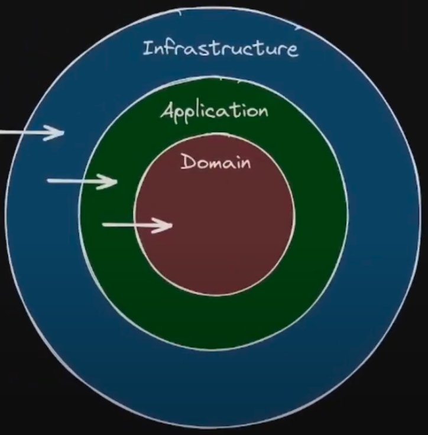

# Flask docker template

  Template para crear aplicaciones en python usando la libreria flask-smorest, empaquetando la aplicacion en un contenedor de docker, utilizando una base de datos postgresql.

   
  &nbsp;
  
  &nbsp;
  
  &nbsp;
  
  &nbsp;
  

Esta aplicacion esta construida bajo la arquitectura hexagonal

  

 

# Domain
    1. Entidades
    2. Interfaces
    3. Clases abstractas

# Application
    1. Casos de uso

# Infrastructure
    1. Base de datos
    2. Controladores
    3. Frameworks
    4. Librerias